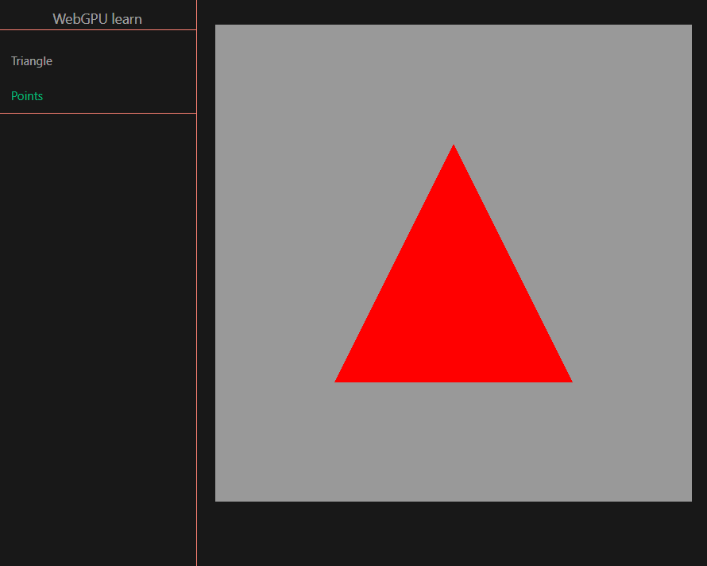

# Webgpu Study

This project is created with Vue for the scaffolding.

To see the live page please go to: [HERE](https://gammafp.github.io/webgpu-study/).



## Scripts

To install dependencies:
```
npm install
```

To dev the project:
```
npm run dev
```


## Files

Each excersice I have to study is inside `src/views/`.

Inside the `views` you can find some Vue pages components with some simple code with webGPU configuration.

For example:

```js
<script setup lang="ts">
import { onMounted } from "vue";

import CanvasCotainer from "../../components/CanvasContainer.vue";

const render = async () => {
    
    ... 

    // create shader module
    const shaderModule = device.createShaderModule({
        code: `
            const pos_constant = array<vec3f, 3>(
                vec3f(0.0, 0.5, 0),
                vec3f(-0.5, -0.5, 0),
                vec3f(0.5, - 0.5, 0)
            );
            
           ...
        `,
    });

    ...

    device.queue.submit([commandBuffer]);
};

onMounted(() => {
    render();
});
</script>

<template>
    <CanvasCotainer />
</template>

```

Each page have a generic `CanvasContainer` component with the id: canvas-container (you can find this file inside `src/components`).

---

Created by Francisco José Pereira Alvarado - (gammafp).  
Twitter: https://twitter.com/gammafp